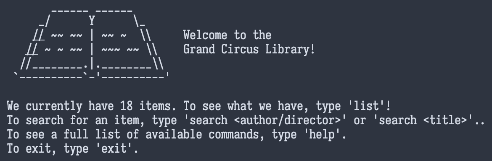

# Library Terminal
CLI-based application based on a (fictional) library terminal.

# Features
- Dynamic XML-based inventory, allowing the user to add books/movies externally through the Items.xml file.
- Unix-esque command system
- Blackjack game

# Commands
	help - Lists all available commands.
	list - Lists all books and DVDs.
	return - Returns the specified item.  Usage: return <index> OR return <name>
	search - search <author/director> OR search <title>
	checkout - Checks out the specified book.  Usage: checkout <index> OR checkout <name>
	preview - Preview an item before checking it out. Usage: preview <index> OR preview <title>
	duedate - See when an item is due back. Usage: duedate <index>
	playgame - Relax, hop on a computer and play a game!
	donate - Donate a book to the library!
	addemail - Add your email address to join our mailing list! Usage: addemail <email-address>
	removeemail - Unsubscribe from our mailing list. Usage: removeemail <email-address>
	exit - Closes the application
